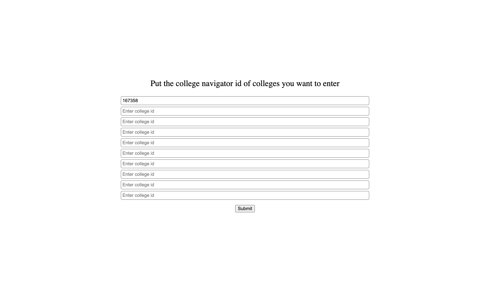
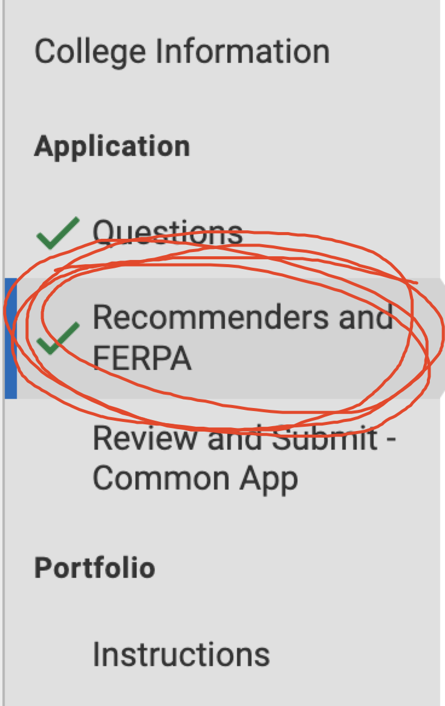

# 서론

이 문서는 곧 대학에 지원하거나 전미 50위권 이상의 대학을 진학하고 싶어하는 DICS 학생들을 위한 문서이다.
대부분의 내용들이 DICS 학생들에게 맞추어져 있으므로 다른 사람들이 참고하기에는 적절하지 않다.
이 문서에서는 AP, SRAR 등에 대한 것들에 상세한 설명을 제공하지 않으므로 나무위키를 참고하길 바란다.

# 전공을 고르는 방법

먼저 대학을 고르기 전에 전공부터 골라야 한다. 미국 대학들은 전체 순위보다 전공별 순위가 훨씬 중요하기 때문이다. 예를 들어 미시건 주립대는 전미 60위권의 대학이지만 핵물리학으로는 MIT를 씹어먹는 대학이다. 그러니 대학을 고르기 전에 먼저 전공을 고르는 것이 중요하다. 전공은 10학년때 정해두는 것이 가장 좋지만 자신이 11학년이라고 해도 걱정없다. 자신이 가장 좋아하는것 가장 즐길 수 있는 것을 골라라. 지금 고르지 못했다고 해도 괜찮다. 전공이 없이 대학에 가도 되고, 전공과 다른 직업을 가지고 될지도 모르는 일이다. 다만, 대학교를 선택하는 과정에 있어서 전공을 정해두는 것이 더욱 메리트가 있다는 것이다.

# 자신에게 맞는 대학을 찾는 방법

위에서 언급했다시피 자신에게 맞는 대학을 찾기 위해서는 전공이 가장 중요하다. 전공을 정했다면 그 다음으로는 자신의 GPA, 토플 점수, SAT 점수를 고려하여 대학을 골라야 한다. 대학 정보를 제공해주는 사이트는 여러가지가 있지만 나는 아래 2가지 사이트를 추천한다.
https://www.usnews.com
https://www.niche.com
자신의 토플 점수가 95점 이상이라면 왠만한 커트라인은 다 넘긴다고 생각하면 되지만 그래도 불안하다면 구글에 000 University toefl requirement라고 검색하라 상단에 학교 공식 사이트가 나올텐데 거기 적혀있는 토플 점수가 커트라인이다. (절대로 구글에 나오는 정보를 믿어서는 안된다. 학교 공식 사이트만 믿어야지 나중에 항의할 수 있다.) SAT나 GPA도 비슷한 방식으로 검색하면 되지만 SAT랑 GPA는 requirement보다는 average로 검색하는편이 정확하다.
등록금, 합격률, SAT 필수 여부, GPA 필수 여부에 대한 정보를 알고 싶다면 내가 만든 사이트를 참고하라.
사용 방법:

1. Common App에 My College에 들어가서 아무 대학이나 클릭 후 (College Search에서 대학을 선택한 후여야만 한다) 아래 보이는 College Navigator를 클릭한다
   
2. 그러면 https://nces.ed.gov/collegenavigator/?id=167358 이러한 형식의 웹 페이지가 열릴텐데 id= 뒤에 있는 숫자들을 복사한다.
3. 내가 만든 웹 사이트로 가서 해당 숫자들을 붙여 넣는다.
   
   https://daveg7lee.github.io/college_researcher/
   또한 아래는 내가 가고 싶은 대학교를 정리할때 사용했던 스프레드시트이다. 학비, 합격률, 토플, 에세이 개수, 지원비를 입력하면 평균 혹은 총합을 알려준다. 잘 발전시켜서 사용하길 바란다.
   https://docs.google.com/spreadsheets/d/1QA-i3MGf459GJFWulyaZH8VXqIWFB2d3uaarYeK0t5k/edit?usp=sharing

## 전공별 대학 추천

솔직히 나도 아는게 많다고 할 수는 없는 수준이지만 그래도 지난 2개월 동안 조사한 바를 바탕으로 추천하도록 하겠다.

### Computer Science

https://www.usnews.com/best-graduate-schools/top-science-schools/computer-science-rankings
대학을 선택한 기준은 순위, 합격률, 취업률, 인지도를 바탕으로 선택하였다. 물론 이 글을 읽는 학생들은 나보다 우수할 것이 저명하므로 아래 리스트보다 한 두단계 높은 대학을 지원하길 바란다.

- Northeastern University (co-op 전미 1위, CS 전미 35위, 보스턴에 위치함) - 실리콘 밸리 취업률 전미 15위
- Penn State (CS 전미 35위, 인턴십이 잘 되있다고 함, 한인 많음)
- RIT (CS 전미 77위, co-op 전미 5위) - CS 랭킹은 낮지만 애플, 구글, 마이크로소프트 같은 회사들과 co-op이 연계되어있음
- Stony Brook (CS 전미 46위, 지난 2년간 랭킹 40위 상승, 꾸준히 상승할 것으로 예측되는 대학, 맨헤튼과 1시간 정도 거리에 위치)
- Ohio State (CS 전미 24위, 이과가 강한 학교, 대도시에 위치해 살기 좋음)
  이보다 좋은 대학이 훨씬 많지만 DICS에서 합격할 가능성이 가장 높은 대학들로 추려보았다.

# 토플에 대하여

토플. DICS에서 가장 중요하다고 생각하는 요소 중 하나이다. 내 개인적인 생각과 경험으로는 토플은 크게 중요하지 않다. 토플 110점을 장학금을 주는 경우는 거의 없다. 생각해보자. 만약 한국으로 유학을 오는 유학생이 한국어 검정 능력 시험에서 100점을 맞았다고 한다면, 분명 한국어 공부를 열심히 한 학생으로 비치겠지만 공부를 잘한다고 생각하기에는 무리가 있을것이다. 그러니 토플은 80점대만 넘으면 SAT와 병행하는 것을 추천한다. SAT 공부를 하다보면 토플은 자연스럽게 할 수 있을 것이다.
토플 공부용으로 추천하는 사이트는 https://toeflgo.ets.org/dashboard 이게 있고
리스닝 연습으로 추천하는 유튜브는 아래 2가지 정도가 있는데 찾아보면 비슷한 것들은 충분히 많은 것 같다. 아래 유튜브들의 공통점은 1. 삶의 도움이 되는 조언이고 2. 재미있고 3. 영어이지만 4. 영어를 못해도 이해할 수 있게 한국어 자막이 있다. 5. 마지막으로 불필요하고 흐름을 끊는 부연설명이 없다.

1. https://www.youtube.com/@projsnowball
2. https://www.youtube.com/@TV-kt8fj
   여기서 추가로 말하고 싶은 것은 한국어 자막이 있으면 영어가 늘지 않는다고 말하는 경우가 있는데 나 같은 경우에는 한국어 자막을 키고 거의 100시간이 넘는 코딩 강의를 들었다. 강의의 내용을 모두 이해하기 위해 정말 치열하게 들었고 계속해서 빠르게 내용을 이해하기 위해 노력하다보니 어느 순간 자막을 끄고도 내용을 이해할 수 있었고 150시간이 넘어가자 영어를 아무 어려움 없이 이해할 수 있었다. 그러니 그냥 들어라. Just Do it.

# SAT와 AP 그리고 GPA

## SAT

미국 대학 진학중 가장 중요한 요소 중 하나이다. 사실상 한국의 수능이나 다름없다. 내가 대학에 진학하고 있는 2023-2024년까지만 하더라도 코로나의 여파로 인해 SAT가 필수가 아닌 대학이 많지만 내년만 되더라도 많은 대학이 다시 SAT를 필수로 받을 것으로 예상된다. 따라서 앞으로 DICS 학생들에게 SAT는 옵션이 아닌 필수가 될 것이다.

### SAT 공부 방법

솔직히 말하자면 나는 SAT를 준비하지 않았다. 한두달 정도만 빨리 시작했으면 가능했을 것 같기도 한데 그때는 조금 귀찮기도 했다. 여러분은 나와 같은 실수를 범하지 않기 위해 지금 당장 SAT 공부를 시작하자. 내가 추천하는 사이트는 칸 아카데미이지만 이 부분은 김주영의 조언을 받아 추가로 수정하겠다.
https://www.khanacademy.org/

## AP

마찬가지로 좋은 대학에 진학하고 싶다면 거의 필수적인 요소 중 하나이다. 거의 모든 국제학교는 AP 코스를 제공하고 있지만 모두 알다시피 DICS는 아니다. 따라서 AP 시험을 쳐야만 하는데 이 시험을 일년에 딱 한번만 칠 수 있으며 서울에서만 응시할 수 있다. 시험은 5월달에 있지만 접수는 그 전년도 11월까지만 받는다. 그러니 11월에 접수하고 4개월동안 열심히 공부한다면 충분히 높은 점수를 받을 수 있을 것이다. 어떤 AP를 얼마나 응시해야 좋을지는 아래 영상을 참고하자
https://www.youtube.com/watch?v=UoyuLya3NFo&t=2s
AP 신청 사이트: https://www.fulbright.or.kr/registration/

# 추가적인 활동 (Activities, Honors)

30위권내 대학에 진학하고 싶다면 필수적인 요소이다. 보통 주로 하는 활동으로는 MUN 같은 활동이 있다고 하는데 과연 그렇게 해서 눈에 띌 수 있겠는가? 좀 더 돋보이는 학생이 되자

## 대회

무조건 대회란 대회는 모두 나가라. 특히 자신의 전공과 관련된 대회라면 더욱 좋다. 게다가 DICS에서는 아무런 제약 없이 외출도 나갈 수 있으므로 어떻게든 나갈 수 있는 대회는 모두 나갈 수 있도록 하라. 나 같은 경우에는 대회 4개에 출전해서 2개의 대회에서 상을 받았는데 아직도 조금 더 나갈걸 후회하는 부분이다.

## 창업

가장 좋은 활동 중 하나이다. 내가 과연 어떻게 창업을 할 수 있나 라고 생각한다면 그런 생각은 접어라. 지금은 누구든 창업하기 가장 좋은 시기이다. 어떠한 종류의 회사라도 좋으니 설립하고 유의미한 활동을 하여라. **자세한 예시는 추후에 첨부하겠다.**

## 인턴십

인턴십은 내가 한 활동 중 가장 잘했다고 생각되는 활동 중 하나이다. 나는 2021년부터 넥슨의 데이터 분석가와 함께 Team verse라는 회사를 운영해가고 있는데 자신이 관심있는 분야에서 일을 하다보면 그 누구도 가르쳐 줄 수 없는 경험들을 얻게 된다. (설사 그게 나쁜 것이라 하더라도) 그러니 어떤 방법을 써서라도 인턴십을 얻기 위해 노력하라. 소규모 스타트업들은 무급 인턴십을 선호하므로 소규모 스타트업들에게 접근해보는 편이 좋을 것이다.
스타트업의 정보를 얻고 싶다면 아래 사이트르 참고하라
https://disquiet.io/

## 동아리

자신이 관심있는 분야의 동아리 부장을 맡아라. 동아리 부원들을 최선을 다해 열심히 가르치고, 여러 프로젝트들을 진행하라. 아래에서 서술하겠지만 확실한 결과가 있는 프로젝트를 함께 진행하는게 중요하다. 아무리 멋진 프로젝트라도 혼자 진행했다고 한다면 메리트가 조금 떨어진다. 미국 대학 뿐만 아니라 회사들까지 협업하는 능력을 중요하게 여기기 때문이다.

## 프로젝트

동아리 부원들끼리 하면 최고이겠지만 안된다면 친구, 아니면 외부의 모르는 사람들이라도 좋으니 어떤 프로젝트든 시작하라. 나는 12학년들끼리 흰돌 컴퍼니라는 회사를 설립하여 리비아의 태풍 피해를 돕기 위한 프로젝트를 진행하였다. 큰 이슈가 되는 것이 중요하다. 어떤 활동이든 눈에 띄는 활동을 하라

# 커먼앱 작성하기

솔직히 이 부분은 내가 크게 말해줄게 없는 부분이다. 커먼앱에 적혀있는대로 자신의 인적 사항을 적고, 자신이 이때까지 해온 활동들, 에세이 등을 적으면 된다. 길어도 2시간이상 소요되는 일은 없을텐데 어렵다면 주위 선생님 혹은 선배들에게 도움을 청하자.

# 에세이 작성하는 법

에세이도 입시에서 정말 중요한 부분을 차지한다. 입학 사정관에게 자신에 대해 어필하고 설명할 수 있는 거의 유일한 방법이기 때문이다. 에세이를 쓰기 위해서는 먼저 위에서 한 활동 중 자신이 가장 자랑스럽게 여기는 활동을 골라서 작성하는 것을 추천한다. 나는 처음 대회에 나가서 우승하였던 이야기를 에세이로 작성하였는데 남들이 가지지 못한 특별한 스토리를 조금 더 부풀려서 작성하면 좋을듯 싶다. 물론 에세이는 절대로 혼자서 작성하려고 하면 안된다. DICS에는 학교에 어울리지 않을 정도로 대단한 대학교를 졸업하신 분들이 많으므로 선생님들을 많이 찾아가길 바란다. 나 같은 경우에는 이성실 교수님께 거의 2달 가까이 찾아가서 아래 에세이를 완성하였다.

Topic: Discuss an accomplishment, event, or realization that sparked a period of personal growth and a new understanding of yourself or others.

word limit: 650 words

At 10:30 AM, the moment when the final reckoning was announced, it seemed to mark the culmination of a 24-hour journey, finally bearing fruit. we could not conceal our astonishment as we heard the amazing news. We had not anticipated that our team would secure first place.

I have always been excited about inventing since I was a kid. It was fun to create new things, and I'm still eager to learn more. One day, I learned about coding at a gifted center I attended. As I was also interested in computers, I was completely fascinated about coding. However, the coding taught at the gifted center was not in-depth. So, I started looking for my own resources to study. After three years of study, I had developed a system to manage demerit points for school students and a system to check tardiness using a fingerprint reader. But I still felt incompetent and lacked collaboration experience. So, to fill these gaps in my abilities and knowledge, I decided to participate in a Hackathon.

Hackathon is a collaborative event where product managers, developers, designers work together to create a themed project within a tight time frame, often lasting 24 hours or 2 nights and 3 days. The event typically involves professionals and college students, with few high school students taking part. So, despite the time constraints, many participants manage to produce high-quality work, and some successful startups have emerged from hackathon projects. Organizers either assign teams in advance or allow participants to form teams a week before the event to ensure a balanced mix of skills. However, the hackathon I joined had a unique approach.

Due to the pandemic, the event was hosted online with about 50 participants. Team formation was supposed to happen 30 minutes before the hackathon started, and I learned that every team had already been created with a minimum of four members, except for ours, which had only two. Undaunted by the challenge, we chose to adopt the name 'The Underdogs' and remained determined to win.

The hackathon's theme was to develop an app for creators. Our team, composed of strangers, had lengthy brainstorming sessions compared to other teams due to the need for sharing ideas. After a never-ending discussion, we decided to create a funding website to support video content creators. There was no one else to handle the development except me, so I began building the features right away. But, I soon encountered critical structural flaws, resulting in a complete restart. When I first realized it, I really wanted to jump out the window. Despite the setback, I set aside my frustration, deleted all the previous code, and started anew.

Our team persisted in the competition without considering obstacles. The only thing that we could and should is to encourage and support one another in order to persevere all the way to the end. Frankly, when I discovered a structural defect and had to start over, I thought that we wouldn't make it to finish all the required features, and that we might have to turn in an incomplete project. But we pulled it off because of our strongly persisted passion to address the issue, and we literally refused to give up. I also learned how to communicate and collaborate with non-developers, as I stayed up all night developing features, fixing errors, and getting feedback.

After the final presentation, I felt a deep sense of accomplishment that had nothing to do with winning or losing. For me, it was like a trophy that can only be earned by those who refuse to give up. And beyond the ranking and the quality of the result, I was convinced that I had created a valuable asset that could not be exchanged for a first place finish, one that would increase the price of my life and give me a stronger sense of challenge for a new future.

# 대학 지원하기

대학에 지원하기 위해서 필요한 것은 내가 위에서 설명한 것들 뿐이다. GPA 4.0, 100점이 넘는 토플 점수, 1450점이 넘는 SAT 점수, 4점 이상의 AP가 4개 이상 있다면 어느정도 준수한 스펙을 가지고 있는 것이니 자부심을 가져도 좋다. 하지만 위 점수를 만족하지 못한다면 에세이와 액티비티에 조금 더 공을 들일 필요가 있다. 특히 액티비티는 한 순간에 만들 수 있는게 아니므로 9학년때부터 차근차근 준비하는 것이 아주 중요하다.

## 대학별 질문

College Search 탭에서 가고 싶은 대학들을 추가하면 My Colleges 탭이 위와 같이 변하게 된다. 여기서 대학 이름을 클릭하면 대학별로 Questions 라는 탭을 볼 수 있는데 여기서 대학별로 다른 질문들에 대답해야 한다. 대부분 거기서 거기인 질문들이지만 명문대일 수록 질문들이 어렵고 까다로워지는 경향이 있고 에세이를 더욱 많이 요구하는 경향이 있다. 어렵지 않을 것이므로 그냥 넘어가겠다.

## 추천서

Questions 밑에 Recommenders and FERPA 라는 칸이 존재한다. 여기서 추천서를 보내는건데 먼저 8월달이 되서 커먼앱이 열리자마자 바로 12학년 담임 선생님부터 추가하라. 담임 선생님은 Counselor로 추가하면 되는데 최대한 빨리 추가하는데 유리하다.

invite recommenders라는 버튼을 누르면 위 사진과 같은 화면이 뜨는데 여기서 선생님들과 기타 다른 추천인(교장 선생님, 고용주 (인턴십을 진행한 경우) 등)들을 초대하면 된다.
여기서 또 다른 팁을 주자면 추천서는 최대한 빨리 8월달 내로 이때까지 자신이 해온 활동들을 잘 정리해서 들고가는 편이 좋다. 그렇게 해야지만 선생님도 학생의 장점을 최대한 부각시켜 줄 수 있기 때문이다. 그리고 이건 내 개인적인 생각이지만 가장 먼저 찾아가는 학생에게 가장 열심히 써주시는 것 같다. (솔직히 나라면 3명 이상 쓰다보면 귀찮아져서 열심히 못 쓸거 같다... 그러니 최대한 빨리 찾아가자)
아래는 내가 선생님들께 추천서를 부탁드릴때 챙겨갔던 문서이다.
https://docs.google.com/document/d/176v56uTeY_OQ4xJdqWi0gwFIj8ehsSQYOwQ3E02DPic/edit?usp=sharing
다시 한번 강조한다. **추천서를 부탁드릴땐 최대한 빨리 찾아가라**

## 지원하기

## 공식 점수 보내기

추천서까지 모두 받았다면 이젠 정말 지원할 일만 남았다. 나는 이 사실을 몰라서 정말 Early Action을 통째로 날릴뻔 했다. **토플, SAT 등의 공식 점수는 Deadline 전까지 지원하는 학교에 도착해야만 한다.** 한 마디로 토플 점수와 SAT 점수는 지원하기 전에 미리 보내야 한다는 것이다. 내가 추천하는 것은 지원할 대학이 모두 정해졌을 9월말 혹은 10월 초에 점수를 보내는 것이다. 나는 이러한 사실을 모르고 Deadline까지 마냥 기다리고 있다가 Deadline 13일전에 간신히 제출했다. 토플 점수가 보내지는데는 최소 일주일에서 13일까지 걸린다고 하니 최종 점수가 나왔다고 하면 바로 보내는걸 추천한다. (토플에 경우 시험을 치기전 해당 시험의 점수를 공짜로 몇 군데 보낼 수 있는 옵션이 있던걸로 기억하는데 해당 시험에 자신의 점수가 자신이 있다면 이 방법도 추천한다.)

## 지원서 제출하기

SAT와 토플을 모두 보냈다면 이젠 Fee를 지불하고 지원서를 제출하면 되지만... 여기서도 몇가지 팁이 있다. SUNY 대학들은 매년 Fee를 면제해주는 기간이 존재한다. 따라서 SUNY 대학들을 지원할 예정이라면 그 기간을 노려 지원하면 된다. 또한 몇몇 돈이 많은 명문 대학들은 그저 이메일을 보내는 것 만으로도 Fee를 면제해주기도 한다. 그러니 최대한 Fee Waiver를 받기 위해 노력하자. (작은 돈으로 보이더라도 몇 개 지원하다보면 70만원은 거뜬히 넘어가기 마련이다.)

## 지원서 제출 후

제출 후에는 보통 대학들과 직접적으로 소통하게 된다. 보통 지원한 후 2~3일내로 대학에서 메일이 오게 되고 대학 자체 사이트에 가서 대학에서 요구하는 materials들을 업로드하거나 보내게 된다. 예를 들어 펜 스테이트에서는 SRAR 이라는 것을 요구하는데 이에 대해서는 아래에서 설명하겠다.

# 장학금

미국 대학들은 평균적으로 5천만원을 호가하는 엄청난 가격을 자랑하므로 장학금이 필수적이다. 물론 부모님의 재력이 일년에 7천만원 정도는 어렵지 않게 감당하실 수 있다면 이런 귀찮은 일은 굳이 하지 않아도 된다.

## CSS Profile

이제 양키에 대한 혐오감이 생길 시간이다. 이 멋진 친구들은 부모님의 출퇴근 교통비까지 물어보며 집안의 재력을 알기위해 노력할텐데 어떠한 질문들이 있는지, 어떠한 것들을 준비하면 좋은지 아래 첨부하도록 하겠다. 참고로 CSS Profile 공식 사이트는 굉장히 불친절하여 나는 아래 정보들을 모으는데만 2시간이 넘는 시간을 소모하였다.

### CSS 질문 목록

1. Amount Kihyun received in scholarships and grants for 2023-24.
2. Amount Kihyun's parents paid toward Kihyun's education for 2023-24.

### 22년도 income

1. 아버지의 22년도 수익
2. 어머니의 22년도 수익
3. 고용주로부터 받은 총 보수 (필수)
4. Interest income (이자는 예금계좌나 예금증서 등 예금된 자금으로 벌어들이는 돈입니다. 과세 금액과 면세 금액을 모두 포함합니다.)
5. Dividend income (배당금은 기업이 이익에서 주주에게 지급하는 금액입니다. 과세 금액과 면세 금액을 모두 포함합니다.)
6. Net income from businesses or partnerships (required) (순이익은 수익에서 해당되는 모든 비용, 세금 및 비용을 뺀 금액입니다. 보고된 금액에는 해당 손실이 반영되어야 합니다.)
7. Net income from rental real estate, royalties, estates, or trusts (임대 부동산, 로열티, 부동산 또는 신탁에서 발생한 순이익)
8. Net income from farms
9. Other taxable income (본 신청서의 다른 곳에서는 보고하지 않은 자본 이득, 연금, 연금, 실업 수당, 위자료 등 기타 과세 소득의 모든 출처를 포함하십시오.)
10. 이 신청서의 다른 부분에 보고되지 않은 연금, 연금 또는 퇴직금 수령액
11. 모든 세금, 의무 원천징수, 지급 또는 원천징수된 적립금. 소득세, 주세, 지방세, 부담금 및 의무 퇴직금이 포함됩니다. (필수의)
12. 2022년에 성직자 또는 기타 직업으로 받는 주택, 식비, 기타 생활수당(필수) (현금 지급액과 혜택의 현금 가치를 포함합니다. 또한 고용주의 임금, 소득 또는 보상의 일부로 아직 포함되지 않은 금액도 포함하세요. 기지 내 군용 주택의 가치나 주택에 대한 기본 군인 수당의 가치는 포함하지 마십시오. 또한 이 신청서의 다른 곳에 보고된 금액을 포함하지 마십시오.)
13. 2022년 기타 비과세 소득(근로자 보상, 비과세 장애 혜택, 기타 가족 구성원으로부터의 소득을 포함하되 이에 국한되지 않음).
    포함하다:
    - 근로자 재해 보상
    - 비과세 장애
    - 다른 가구 구성원, 친척, 친구가 제공한 금전 또는 지출 비용
    - 이 신청서의 다른 부분에 보고되지 않은 비과세 병역 혜택
    - 철도 퇴직 혜택의 비과세 부분
    - 기타 모든 비과세 소득 및 혜택
      포함하지 마십시오:
    - 받은 자녀 양육비 등 본 신청서의 다른 곳에 보고된 소득
    - 학생 학자금 지원금
    - 교육인력투자법 혜택
    - 보훈대상자 교육혜택
    - 전투 급여

## 23년도 income

1. 아버지의 23년도 수익
2. 어머니의 23년도 수익
3. Other taxable income (required) (학생의 부모가 2023년 소득세 신고 시 신고할 것으로 예상되는 이자 및 배당 소득을 포함하여 기타 과세 대상 소득의 총액을 입력하세요.)
4. Untaxed income and benefits

   1. 2023년에 현재 보유하고 있거나 받게 될 비과세 소득을 신고하세요.
      포함하다: - 퇴직 기여금(IRA/Keogh 계좌, 401k, 403b, 457 등) - 연금 또는 퇴직 계좌의 비과세 분배금 - 대학생을 제외한 모든 가족 구성원을 위한 비과세 사회보장 혜택 - 자녀양육비 수령 - 유연한 지출 계좌 및 의료 저축 계좌(FSA 또는 HSA)에 대한 기부 - 군인, 성직자 등 주택수당 혜택 - 보훈대상자 비학력혜택 - 근로자 재해 보상 - 기타 모든 형태의 비과세 소득 및 혜택
      포함하지 마십시오: - 친구나 친지로부터 금전 이외의 선물 및 지원을 받는 경우 - 보훈교육 혜택 - 전투 급여

5. 부모님은 2024년에 신규 취업, 실직, 퇴직, 혜택 변경 등으로 인해 상당한 소득 변화를 예상하시나요?

## Parent Employment Intro

1. 아버지의 직장 정보 (무슨 일을 하시는지, 어디서 일하시는지, 얼마나 일하셨는지)
2. 어머니의 직장 정보
3. 아버지의 퇴직 계획?
   IRA, Keogh, 401k, 403b 또는 기타 세금 유예 플랜
   퇴직 시 사회보장을 받을 계획
   고용주 후원 계획
   공무원 또는 주정부 후원 계획
   노조 후원 계획
   군 후원 계획
   다른 유형의 계획
4. IRA, Roth IRA, Keogh, SEP, 401(a), 401(k), 403(b), 408, 457, 501(c) 과 같은 Sangho의 세금 이연 및 세후 퇴직, 연금, 연금 및 저축 계획의 현재 가치(필수) (이 부모로부터 기부를 받았는지 아니면 고용주가 기부했는지에 관계없이 이 부모의 세금 연기 퇴직 계좌에 있는 총액을 보고하십시오. 확정 혜택 제도의 경우 가장 최근 계좌 명세서의 순자산을 보고하세요.)

## Housing

1. 현재 살고 있는 집에 대하여 (매매한 집인지, 월세인지, 전세인지, 전세 혹은 월세라면 비용은 얼마인지 등)

### 동생 혹은 형이 다니는 학교에 대해서

1. Total cost to attend this school (DICS)
2. Amount received in scholarships, grants, or gift aid (DICS)
3. Total educational expenses paid by Kiwon's parents (교육비(학비, 수수료, 도서, 용품, 숙소, 식사비)를 포함합니다. 스포츠, 밴드, 연극 등 과외 활동에 대한 대출이나 수수료는 포함하지 마세요. 부모가 이혼하거나 별거하는 경우, 해당 가구의 부모가 해당 비용으로 지불한 금액만 입력하십시오.)
4. 지불한 총 교육비 중 수업료는 얼마입니까?

## Parent Expenses

1. Repayment of any college loan debt in 2022
2. Repayment of any college loan debt in 2023
3. Utilities (water, electricity, heat, phone, internet, etc.) (required) (Provide the annual (not monthly) amount.)
4. Food for everyone in the home (required)
5. Clothing for everyone in the home (required)
6. Household necessities (required)
7. Transportation to and from work (required)
8. Other expenses not listed above (required)
   3-4번은 모두 1년치를 계산

## Parent Assets

1. 현금, 저축, 당좌, 예금 계좌의 현재 금액 (필수)
2. 기현의 부모님은 다음과 같은 재산을 갖고 계시나요?
   1. Investments (required)
      1. 투자에는 부모의 다음이 포함됩니다.
      - 529 대학 저축, 등록금 선불 및 기타 대학 저축 계획
      - 주식과 스톡옵션
      - 채권, 저축채권, 뮤추얼 펀드
      - 머니마켓펀드 및 예금증명서
      - 비퇴직 연금
      - 신탁자금, 원자재, 귀금속 및 전략금속, 할부 및 토지매매 계약, 기타 귀중품
        투자에는 부모의 다음 사항이 포함되지 않습니다.
      - 집
      - 사업, 농장, 부동산
      - 은퇴 계획
   2. 토지, 별장 또는 두 번째 주택, 계절별 또는 휴가용 임대 부동산 등 기본 주택 이외의 부동산을 소유하거나 다른 사람에게 부동산을 임대(필수)
   3. 주요 수입원이거나 다른 업무에 추가되는 사업을 소유하거나 운영하는 경우(필수)
   4. 농장 또는 농장의 일부 소유(필수)
3. 본인이 소유하고 있으나 자녀 명의로 보유하고 있는 자산(필수)
4. 투자의 현재 시장 가치 (필수) (2-1)
5. 부동산 수(필수)
6. 부동산 정보 - 위치, 이 부동산을 다른 사람에게 임대하는 연간 개월 수(필수), 부동산을 구입한 연도(필수), 이 부동산의 구매 가격(필수), 이 부동산의 현재 시장 가치(필수), 이 부동산에 대해 지불해야 할 금액(빛)

## Student Resources

1. 기현이 2022년에 재정지원으로 받은 과세소득은 얼마나 되나요?
2. 2022년 기현이 받은 비과세 사회보장 혜택에 대해 자세히 알려주세요. (학생인 귀하가 2022년에 받은 비과세 혜택 총액을 포함하세요. 귀하의 부모가 귀하를 위해 받은 혜택은 포함시키지 마십시오.)
3. 기현이 2022년에 받은 기타 비과세소득에 대해 알려주세요.
4. 기현의 예상 수입을 입력하세요. 기현이 결혼했다면 다음 페이지에서 수입에 대해 질문드리겠습니다.
5. 기현 씨는 2024-25학년도 교육비로 얼마를 다음 출처로부터 받을 것으로 예상합니까?
   1. Their parents (required)
   2. 지원하는 대학 이외의 출처에서 받는 장학금/보조금(필수)
   3. 부모의 고용주 및/또는 고용주를 포함한 고용주(예: 수업료 혜택)(필수)
   4. 부모 이외의 친척 및 대학 등록금을 지원하는 기타 재원 (필수)
6. 기현이는 대학 등록금을 기관이나 재단으로부터 지원받나요? (필수의)
7. 기현은 등록금 혜택을 받을 수 있나요? (필수의)학생의 고용주, 학생의 부모의 고용주 및/또는 학생 배우자의 고용주로부터 학생이 받을 것으로 기대하는 모든 혜택을 포함하십시오. 이러한 혜택이 특정 학교에서만 사용될 수 있거나 다른 제한 사항이 있는 경우, 신청서 마지막에 있는 특수 상황 섹션에 설명하십시오.

## 마지막 추가 질문

1. 당신의 부모님은 주세, 지방세, 부동산세, 재산세로 얼마를 지불하셨습니까? 귀하의 부모가 Schedule A를 제출한 경우 5d행을 보고하십시오. 부모님이 스케줄 A를 제출하지 않은 경우, 주 세금 신고서에서 납부한 소득세를 신고하고 1098 모기지 이자 명세서의 10번 상자에 기재하십시오.
2. 2022년에 가족 구성원이 자산이나 기타 가치 있는 상품을 상속받았습니까?
3. 그렇다면 상속받은 가족 구성원, 받은 자산의 가치 및 상속받은 사람을 명시하십시오. 신청서에 이미 보고한 경우 표시하십시오. 그렇지 않은 경우 보고되지 않은 이유를 설명하십시오.
4. 학생 자산 항목에 신고된 금액 중 부모님이 제공한 금액은 얼마입니까?
5. 재정적인 지원을 해줄 스폰서나 외부 기관을 확보하셨나요?
6. 그렇다면, 얼마나 많은 재정적 지원을 제공할 것입니까?

놀랍게도 이 모든게 전체 질문의 일부일 뿐이지만 나머지 질문들은 대체로 대답하기 쉬운 편이므로 위 질문들에 맞춰서 몇가지 서류들을 준비해두는 것이 좋다. (**소득금액 증명서, 세금납세 증명서, 재산세 납부 증명서**)

## Merit based

merit based 장학금은 어느 대학이나 기본적으로 있는 장학금으로 GPA가 어느 정도 이상이라면 무조건 주는 장학금이다. 무조건 주는만큼 자신들의 양심을 반영한 만큼 주므로 거의 없다고 생각하는 편이 마음이 편하다.

# SRAR에 대하여

자신이 지원한 대학이 요구하지 않는다면 그냥 무시하고 넘어가라
SRAR은 고등학교의 성적을 Self로 제출하는 Form이다. 대부분의 학교가 여기에 등록되어 있어 어렵지 않게 작성할 수 있겠지만 DICS는 예외가 된다. 학교가 등록되어 있지 않기에 많은 것을 직접 작성해야하고, 많은 어려움을 겪게 된다.

## 학교 등록하기

우리 학교를 등록할때 바로 not listed를 클릭하고 등록하려고 하면 State를 선택하는 칸에 선택지가 없어서 등록이 안된다. 그래서 Daegu를 검색해서 리스트에 학교가 뜨도록 한 다음에 not listed를 선택해서 학교를 등록해야한다. (이거땜에 30분 날렸다...)

## 성적 기입하기

1. 자신의 성적표를 컴퓨터 옆에 들고온다.
2. 성적표를 뚫어져라 쳐다보며 수강하였던 과목들을 하나하나 손수 입력한다.
3. 입력을 마쳤다면 입력한 내용 중 틀린 부분이 있는지 두번 세번 체크한다.
4. 제출하면 끝 (여기서 실제 성적표와 다른 부분이 있다면 입학이 거절될 수 있다.)

# 결론

최대한 상세하게 적어보고자 노력한 문서임에도 불구하고 이 문서도 부족한 부분이 많다. 누구든 수정할 수 있도록 열어둘테니 부족한 부분을 추가하면서 발전하면 좋을 것 같다. 마지막으로 말하자면 인생은 남이 살아주지 않는다. 모두가 자신의 입시에 대해 도와주고 노력해 줄 것 같지만 전혀 그렇지 않다. 그건 너의 입시일 뿐이고 당연히 너가 노력해야하는 부분이다. 최선을 다해 조사하고 여러 루트를 조사하라. (그리고 할 수 있다면 그 경험과 내용을 이곳에 공유하라)
모두가 휼륭한 대학에 입학하길 바라며
